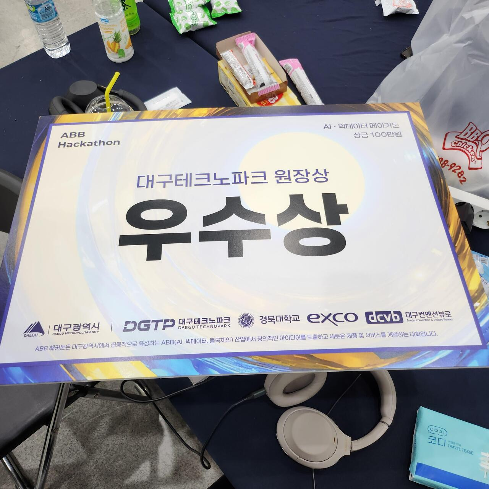
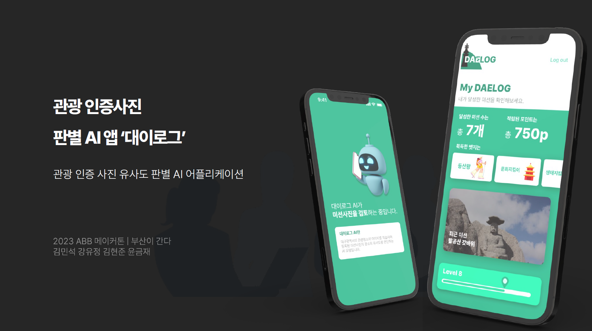
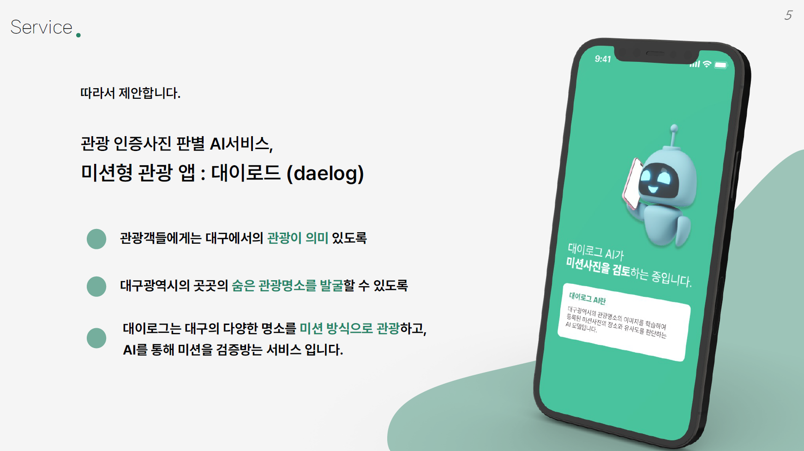
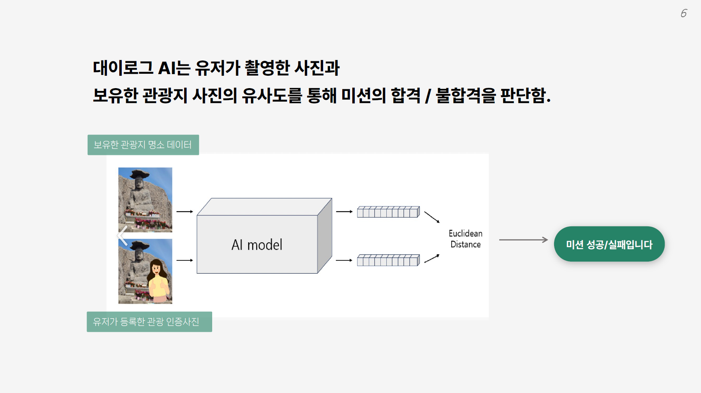
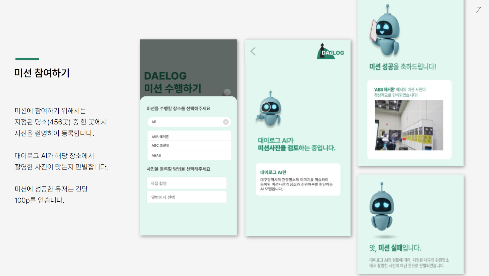
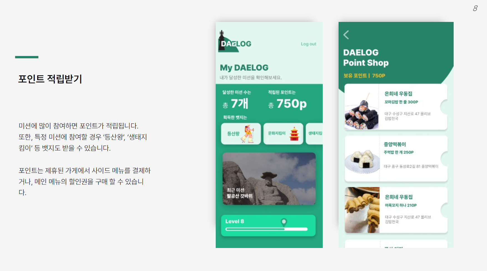

# Daelog

## 💻 프로젝트 소개

- 2023 ABB 해커톤 - AI, 빅데이터(메이커톤) 트랙
- 팀 [부산이간다]: **우수상**
- 프로젝트: **대구 관광 활성화를 위한 관광 인증 사진 판별 AI 앱**
- 해커톤 후기 포스팅: <https://insengnewbie.tistory.com/484>

## :calendar: 개발 기간

[23.10.20~23.11.10]

- 23.10.20~23.10.21: 팀 모집
- 23.10.22~23.11.03: 코딩 테스트 및 예선
- 23.11.09~23.11.10: ABB 해커톤 본선

## 👋 멤버 구성 및 역할

- @KimCookieYa: React Native 클라이언트 개발
- @khj1999: Flask 서버 개발
- @KeumjaeYoon: 비전 AI 모델 개발
- @yujeong09: 프로젝트 기획 및 자료 조사, 프렌젠테이션

## 🌏 개발

React Native(JavaScript) + Flask + MongoDB + pytorch(AI)

## 📚 발표 자료(PPT)

[Daelog 발표자료](./public/Daelog-발표자료.pdf)

## ABB 해커톤 포스터

